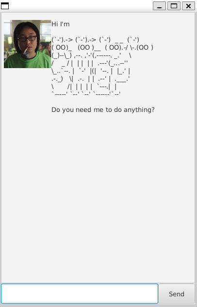

# Shep



# User Guide

Shep is a GUI task tracking app designed for text based inputs. Shep was developed as a brown-field iterative breadth first project stemming from Duke, a chatbot developed for NUS's intro to Software Engineering Course. It's named after a Daft Punk Character.

It is based on the duke task found [here](https://github.com/nus-cs2103-AY2425S2/ip)

## Features

- text based
- **easy** to **learn**
- ~~Fast~~ *Super Fast* to use

### Task Manager

Users can add different types of tasks with different attributes, such as to-dos, deadlines, and events. Users can mark tasks as done, delete tasks, and listing all current tasks.

### Storage

A storage component to ensure that task data is persistently managed across user sessions. Whenever a user is done with a session, the storage component writes to a file. Launching Shep reads from said file

## Shep's Commands

#### List
Type list to see list of tasks.
*list*

```
1. [T][X] Download Shep
2. [D][X] Download Shep (by: Jun 1 2025)
```

#### Mark
Mark a task in the list as done through its index.
*mark <index>*

```
Shep says he's marked:
   [D][X] write essay (by: Oct 10 2025)
```

#### Unmark
Unmark a task in the list as not done through its index.
*unmark <index>*

```
Shep says he's unmarked:
   [D][ ] write essay (by: Oct 10 2025)
```

#### find
Find a list of tasks that contain the specified word.
*find <word>*

```
1. [T][X] Download Shep
2. [D][X] Download Shep (by: Jun 1 2025)
```

#### delete
Delete a task in the list through its index.
*delete <index>*

```
Shep says he's deleted:
   [T][ ] Download Shep
```

#### todo
Add a ToDo task to the list.
*todo <description>*

```
Shep says he's added:
   [T][ ] Download Shep
```

#### deadline
Add a Deadline task to the list. A deadline task has a specified date it must be finished by.
*deadline <description> /by <yyyy-MM-dd>>*

```
Shep says he's added:
   [D][ ] Download Shep (by: Jun 1 2025)
```

#### event
Add an event task to the list. An event task has a starting and ending date it should be done in.
*event <description> /from <yyyy-MM-dd> /to <yyyy-MM-dd>*

```
Shep says he's added:
   [E][ ] Download Shep (from: Jun 1 2025 by: Jun 2 2025)
```

#### bye
Saves Shep's tasklist and exits the application.
*bye*

```
Exits Shep
```
